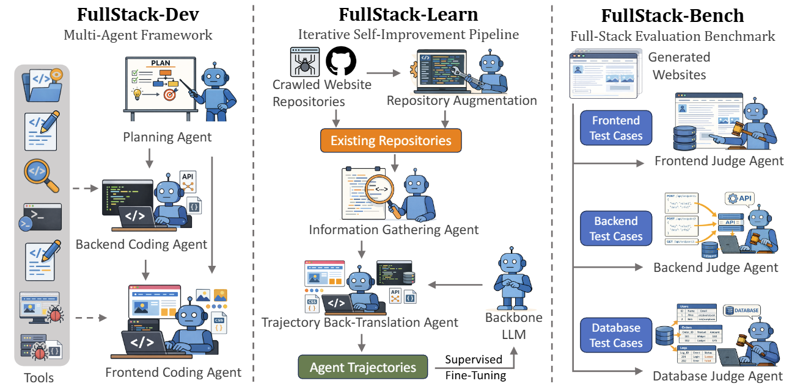
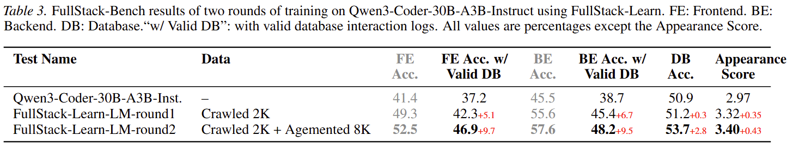

# FullStack-Learn

### Overview

This is a repository for the two-round self-improvement SFT training described in the paper "FullStack-Agent: Enhancing Agentic Full-Stack Web Coding via Development-Oriented Testing and Repository Back-Translation". It is adapted from [Llama-Factory](https://github.com/hiyouga/LLaMAFactory).



### Installation

Run the following commands:

```bash
# install from source
git clone https://github.com/mnluzimu/FullStack-Learn.git
cd FullStack-Learn
conda create -p ./env/fullstack-learn python==3.11 -y
conda activate ./env/fullstack-learn
pip install -e ".[torch,metrics,deepspeed]" --no-build-isolation

# install wandb
pip install wandb

# install megatron
pip install megatron-core
pip install "git+https://github.com/alibaba/roll.git#subdirectory=mcore_adapter"

# install transformer engine (first cd to a path outside this repository)
git clone https://github.com/NVIDIA/TransformerEngine.git
cd TransformerEngine
pip install -U pip wheel setuptools
pip install ninja cmake pybind11
pip install cython
python -m pip install -v --no-build-isolation .

# install flash_attn
pip install flash-attn --no-build-isolation
```

### Quickstart

The config files for the two rounds of training are in `examples/megatron`. The scripts for running the experiments are in `code/train`. Set `WANDB_API_KEY` to [your key](https://wandb.ai/authorize) when launching training tasks to log in with your W&B account.

```bash
# First round of training
bash code/train/qwen3_coder_30b_fullstack-learn_round1_2k.sh

# Second round of training
bash code/train/qwen3_coder_30b_fullstack-learn_round2_10k.sh
```

### Experimental Results

Experimental results of the two rounds of training tested on with FullStack-Dev on FullStack-Bench are as follows:

